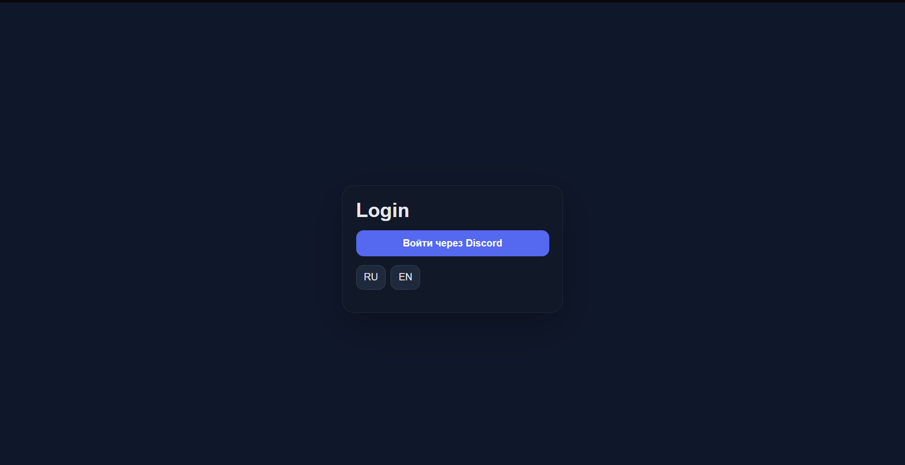
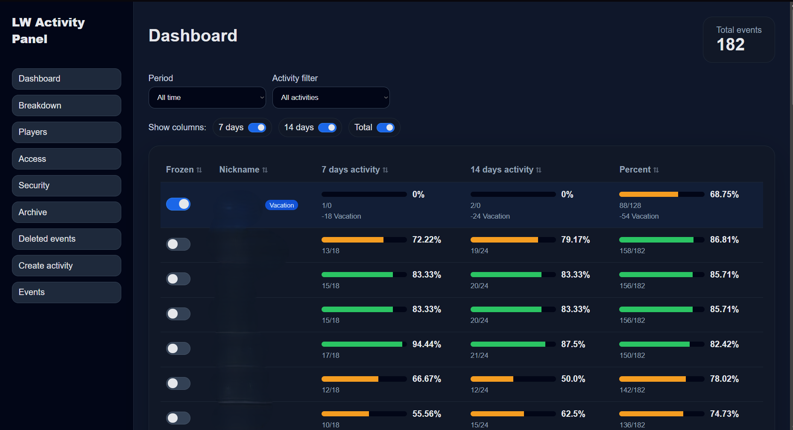
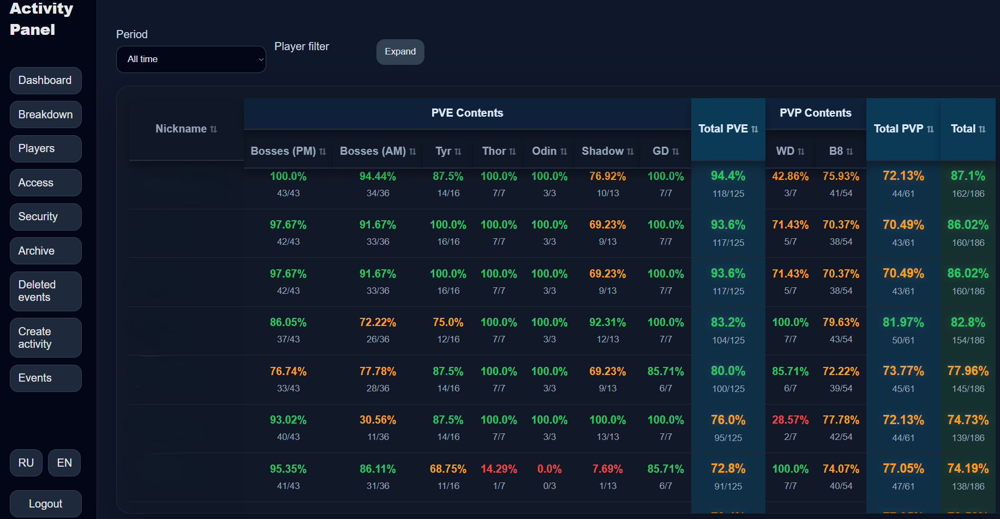
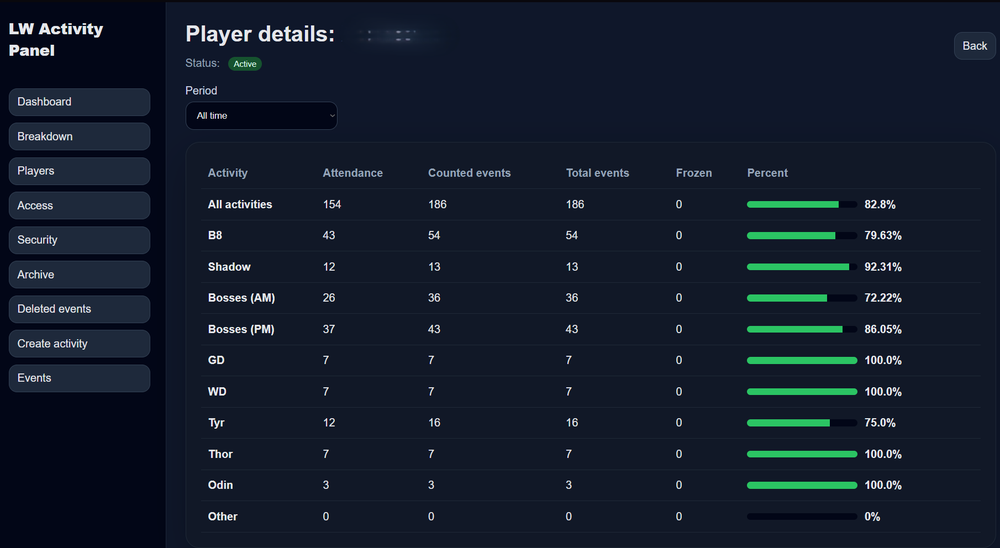
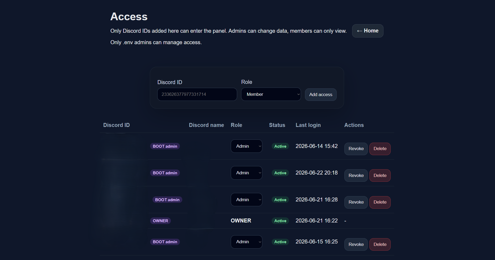
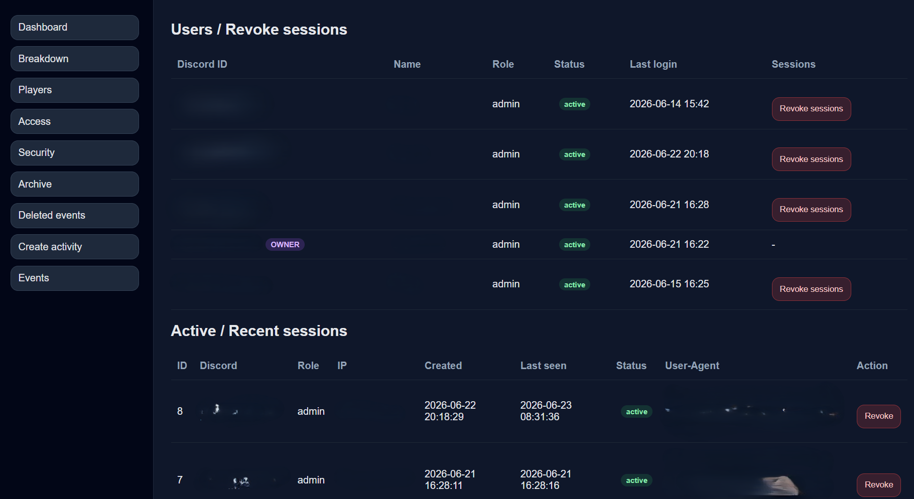
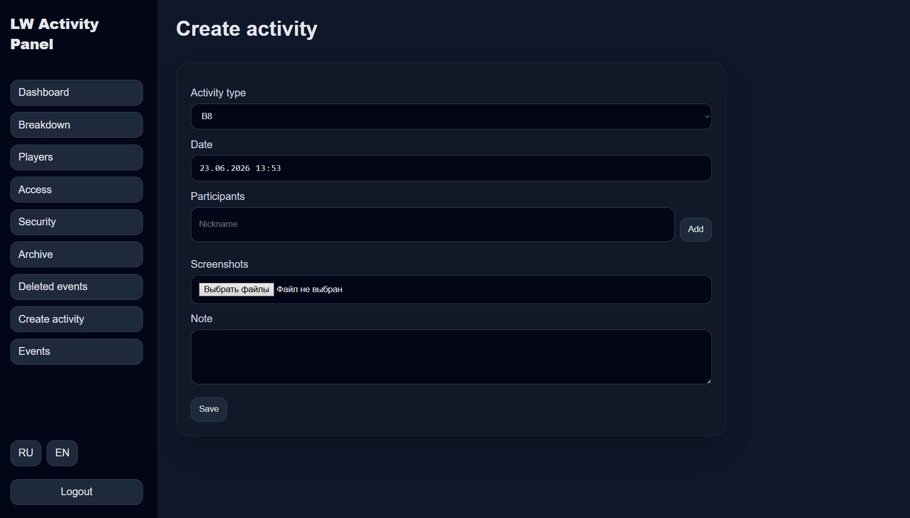
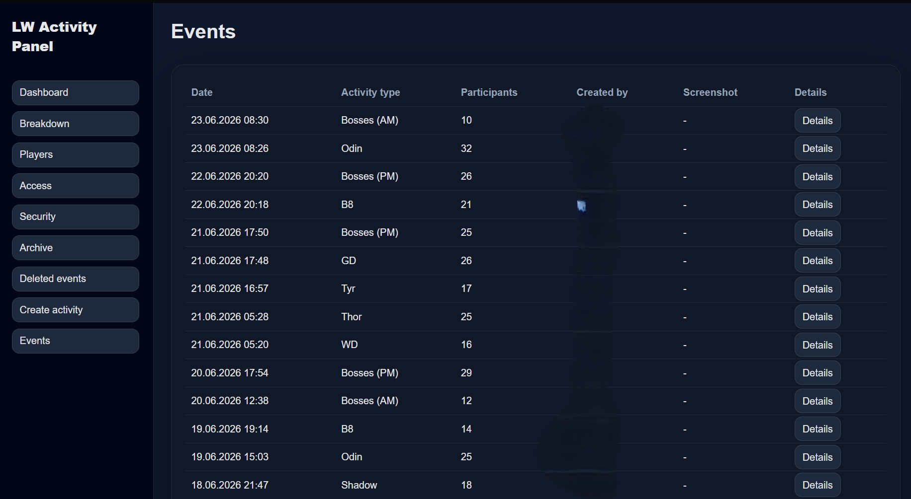
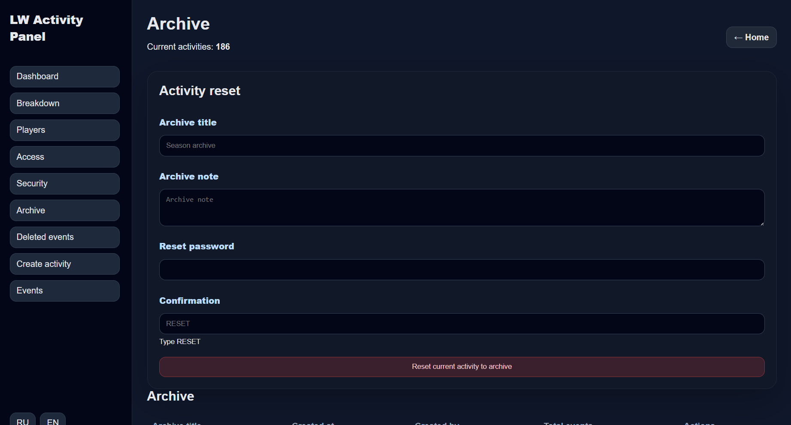

# Community Activity Platform Demo

FastAPI-based web platform demo for activity tracking, attendance analytics, user management and role-based access control.

## Overview

This project demonstrates the architecture and workflow of a real production web platform built for community activity tracking, statistics, access management and operational administration.

The original system was deployed and maintained on a Linux VPS with separate production and laboratory environments. This repository is a portfolio/demo version and does not include private data, credentials, database dumps, tokens or production configuration.

## Features

- FastAPI backend architecture
- SQLite database
- Jinja2 HTML templates
- Discord OAuth authentication
- Role-based access control
- Owner / Admin / Member permission model
- Activity and attendance tracking
- Event history
- Player/member profiles
- Image upload workflow
- Audit logging
- Admin tools
- Production and laboratory environment separation
- Backup-oriented deployment workflow
- Nginx reverse proxy and SSL setup
## Screenshots

### Login Page

Discord OAuth authentication with multilingual interface support.

---

### Dashboard

Activity overview with attendance analytics, filters and performance indicators.

---

### Breakdown Analytics

Detailed attendance statistics by activity type and category.

---

### Player Details

Individual participant activity history and attendance metrics.

---

### Access Management

Role-based access control and Discord user management.

---

### Security & Sessions

Session monitoring and administrative security controls.

---

### Create Activity

Activity creation form with participant and screenshot management.

---

### Events History

Historical event tracking and audit information.

---

### Archive Management

Season reset and archive management functionality.

## Tech Stack

- Python
- FastAPI
- SQLite
- Jinja2
- Discord OAuth
- Linux
- Nginx
- systemd
- SSL/TLS

## Architecture

The platform was designed as a self-hosted FastAPI application running behind Nginx on a Linux VPS.

The system used separate production and laboratory environments to safely test new features before deployment. Access control was implemented through Discord OAuth and internal role mapping.

## My Role

I designed, developed, deployed and maintained the platform.

My work included:

- Backend development
- Database design
- Access control implementation
- Discord OAuth integration
- UI workflow design
- Linux VPS setup
- Nginx reverse proxy configuration
- SSL setup
- Backup automation
- Testing in laboratory environment
- Production support and bug fixing

## Security Note

This repository is a portfolio/demo version.

Private data, user IDs, Discord configuration, tokens, `.env` files, database dumps and production deployment files are not included.

## Status

Portfolio/demo project.
